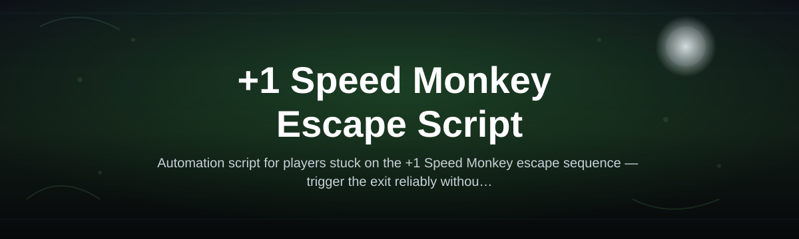
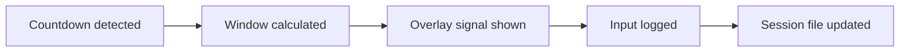

# speed-monkey-escape-script

*A timing companion for the "+1 Speed Monkey" escape sequence, built for players who want consistent, repeatable results without guessing frame windows.*

## What this is

+1 Speed Monkey Escape Script is a standalone Windows tool built around one specific moment in the Speed Monkey escape sequence: the narrow window where a well-timed input adds the "+1" bonus instead of letting the run reset. Rather than covering every part of the game, it focuses entirely on that single mechanic, reading the on-screen countdown and helping the player line up their input with the frame that actually counts.

The name reflects what the tool does, not a marketing label. "+1" is the bonus state players are trying to hit, "Speed Monkey" is the game context, and "Escape Script" describes the tool's job: script the escape input with consistent timing so the result depends less on reaction speed and more on repeatable setup. It does not touch save files or game assets — it observes and assists at the input layer.

  

The button above opens the project's landing page, where the current build is available to download.

## Who it is for

- Players stuck on the escape sequence's "+1" window who want a consistent reference point instead of trial and error.
- Speedrunners who need repeatable escape timing to compare run segments fairly.
- Streamers and testers who want reproducible input timing during demonstrations.
- Players curious about how the escape timing detection works, without setting up a development environment first.

## What you can do

- **Track the escape countdown** in real time as it appears on screen, without manual timers.
- **Highlight the "+1" input window** so the exact valid frame range is visible before you act.
- **Adjust the timing offset** to compensate for input lag or personal reaction delay.
- **Log each attempt** with a timestamp and outcome, so you can review patterns across sessions.
- **Bind a dedicated hotkey** for triggering the escape input, separate from other game controls.
- **Run in a lightweight overlay mode** that stays out of the way until the countdown starts.
- **Reset session data** with one action when starting a new practice block.
- **Export attempt logs** as a plain text file for personal review or sharing.

## Getting started

1. Open the landing page linked by the download button above.
2. Download the current release package for Windows.
3. Extract the contents to any folder — no installer is required.
4. Run `speed-monkey-escape-script.exe`.
5. Set your hotkey and timing offset in the first-run prompt, then start the game.

## Requirements

- Windows 10 or Windows 11 (64-bit).
- No additional runtime, framework, or build toolchain — the executable runs standalone.
- No installation of Speed Monkey game files is modified; the script only reads screen and input state.
- A discrete GPU is not required; the tool runs on integrated graphics without issue.

## How it works

1. The script starts and waits for the Speed Monkey escape countdown to appear on screen.
2. It reads the countdown state and calculates the "+1" input window based on your configured offset.
3. It signals the valid window through the overlay, giving a clear moment to act.
4. Your input is logged along with the outcome, whether the "+1" bonus was hit or missed.
5. Logged attempts accumulate in a session file you can review or clear at any time.

## FAQ

**What does the "+1" in the name actually refer to?**
It's the bonus state in the Speed Monkey escape sequence — hitting the input inside the correct window advances your run by one additional step instead of resetting it.

**Is this the same as the game's built-in escape prompt?**
No. The game's prompt is just the visual cue; this script reads that cue and helps you respond to it with more consistent timing.

**Does it modify any Speed Monkey game files?**
No. It observes screen state and sends input signals externally. It does not edit, replace, or inject into game files.

**Will it keep working after the game updates?**
Timing detection is tied to the visual layout of the countdown. If a future game update changes that layout, the overlay may need a corresponding update, which is tracked on the landing page.

**Does it need administrator rights to run?**
Not by default. Some Windows security configurations may prompt for elevated permissions the first time you run a new executable — this is standard for unsigned standalone tools, not a requirement of the script itself.

## Troubleshooting

- **Overlay doesn't appear when the countdown starts** — confirm the game is running in windowed or borderless mode; some exclusive fullscreen modes block overlay rendering.
- **Timing feels consistently early or late** — adjust the offset value in the settings prompt in small increments until the window aligns with your reaction speed.
- **Antivirus software flags the executable** — this is common for unsigned standalone tools; verify the download came from the official landing page before allowing it.
- **Hotkey doesn't register** — check for conflicts with other running overlays or game-capture software, which sometimes intercept global hotkeys first.

## License

Released under the [MIT License](LICENSE). This project is an independent tool built around a specific game mechanic and is not affiliated with or endorsed by the developers of Speed Monkey. Use it at your own discretion and in line with the game's terms of service.

  

